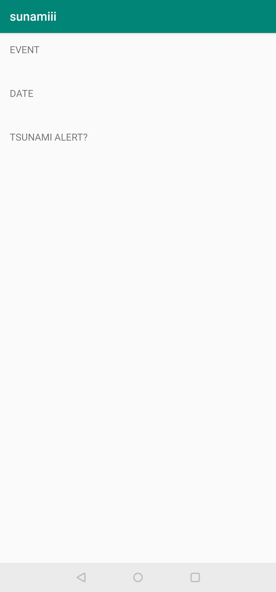

# sunamiii-alert-app

This app displays information about a single earthquake event and whether or not there was a tsunami alert issued for it. Used in a Udacity course in the Android Basics Nanodegree.

The data is retrieved from the USGS service. https://earthquake.usgs.gov/fdsnws/event/1/

